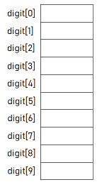
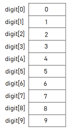
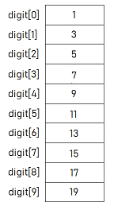

# Week 9 Notes - 29.04.2020
---

<details>

<summary>Arrays </summary>

<br>

* An array is a group of memory locations.
* These locations are related by the fact that they have all the same name and same type.
* We can define an array as follows:

   - type arrName[size];
   
     * Where, **type** is any data type like int, float etc. 
     * **arrName** is the name of the array variable.
     * The square brackets contains an integer value **size**. It is the total number of values we can store in the array variable.
     
* In order to access to a particular location, i.e., an element within the array, we specify the name of the array and the position number (index) of the variable in square brackets.
   

### Example: 

* We want to create an array named digit of size 10 and type as int.

```c 
#include <stdio.h>

int main()
{
     int digit[10];
     
   return 0;
}
```

* The above code allocates memory space for 10 integer data values:



* Now, let's assign digits from 0 to 9 to the corresponding locations in our digit array:

```c 
#include <stdio.h>

int main()
{
     int digit[10];
     
     for(int i = 0; i < 10; i++)
         digit[i] = i;
     
     
   return 0;
}
```
* We can represent the values in the digit array as follows:



* We can change the values in the arrays as we want. Let's multiply each element of the digit array with two and then add 1:

```c 
#include <stdio.h>

int main()
{
     int digit[10];
     
     for(int i = 0; i < 10; i++)
         digit[i] = 2*i+1;
        
     
   return 0;
}
```
* Now our digit array looks like this:



* Let's change the value of the tenth element of the digit array.
```c 
#include <stdio.h>

int main()
{
     int digit[10];
     
     for(int i = 0; i < 10; i++)
         digit[i] = 2*i+1;
        
     digit[9] = 100;
     
   return 0;
}
```
* The digit array now looks as follows:


</details>

## Questions

### Q1 - Understanding Arrays (Teaching Codes Lab7-Ex1)

* Write a program which reads a sentence from the user (read characters until '\n' appears).Your program then should put this sentence into a char array (assume the sentence will be shorter than 50 characters). 

* Then, encrypt this sentence by adding +1 to the value of each character.Then print the encrypted version to the screen. 

* Then decrypt this sentence by adding -1 to each character, and print the decrypted version again to the screen. 

**Sample Input-Output:**


